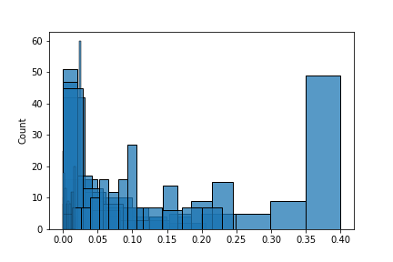
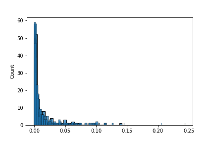

# Generating Mouse Movements with GANs

This repository contains code for Vanilla and LSTM GANs (Generator and Discriminator) that are tailored for mouse movement generation. Look in the `notebooks` directory for examples of full training pipelines (in Colaboratory).

## Get Started

To install with the `python` directory:

```
pip install .
```

## Basic Working Example with LSTMs

```
import numpy as np
import tensorflow as tf
from tensorflow.keras.optimizers import Adam
from pymousegan.models.gans import AdditiveBasicGAN
from pymousegan.models.lstm import BidirectionalLSTMDecoderGenerator, \
  LSTMDecoderGenerator, BidirectionalLSTMDiscriminator
from pymousegan.io.data_aug import unique_batch_reflect

seed = 420
np.random.seed(seed)
tf.random.set_seed(seed)

seq_shape = (100, 3)
noise_size = (100, 100)
d_opt = Adam(lr=1e-4, beta_1=0.5)
g_opt = Adam(lr=1e-5, beta_1=0.5)

model_paths = {}

discrim = BidirectionalLSTMDiscriminator(seq_shape, hidden_units_list=[256, 128],
                                         minibatch_discrim_units=10, minibatch_discrim_row_size=3)
generator = BidirectionalLSTMDecoderGenerator(noise_size, seq_shape,
                                              hidden_units_list=[256, 128],
                                              output_act='tanh')

gan = AdditiveBasicGAN(discrim, generator, d_opt, g_opt, data_aug=unique_batch_reflect,
                       model_paths=model_paths)

!mkdir /content/model_out/
gan.train(coords_dt, num_epochs=15001, batch_size=16, sample_interval=100, output_dir='/content/model_out', save_format='h5')
```

This code will produce a directory `model_out` that contains saved predictions every 100 epochs and the final training graph.

For instance, at 0 epochs, it would look like this:

And at 15,000 epochs, it would look like this:


To train from a checkpoints,

```
model_paths = {
    'discrim_path': '/content/model_out/discrim_105001_weights.h5',
    'gen_path': '/content/model_out/gen_105001_weights.h5',
    'combined_path': '/content/model_out/combined_105001_weights.h5'
}

gan = AdditiveBasicGAN(discrim, generator, d_opt, g_opt, data_aug=unique_batch_reflect,
                       model_paths=model_paths)
```

## Data Overview

| Version    | Mean                 | Standard Deviation   | Min | Max                |
| ---------- | -------------------- | -------------------- | --- | ------------------ |
| 1 (Coords) | 0.40060340244877796  | 0.30481079223569346  | 0   | 1                  |
| 1 (Lags)   | 0.04112467233758684  | 0.06005927064482218  | 0   | 0.9948674898815393 |
| 2 (Coords) | 0.002016191045743645 | 0.5068689870095336   | -1  | 1                  |
| 2 (Lags)   | 0.004615704000000001 | 0.013158585432499348 | 0   | 0.989              |

### `coords_dt_v2.npy`

The paths in this dataset are generally much faster than those in v1. For instance, the distribution in v1 looks like this:

But the distribution for v2 looks like this:

